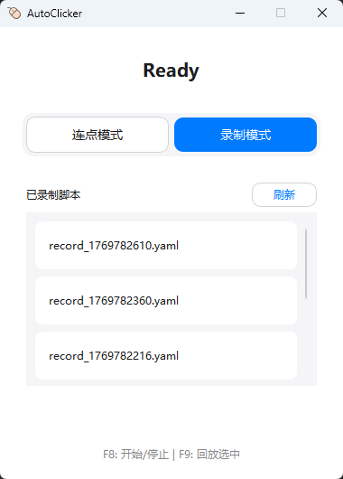

# AutoClicker

## 📖 功能说明
- **连点模式**：在当前鼠标位置高速点击。
- **录制模式**：录制鼠标轨迹与点击，保存为 YAML 脚本。
- **全局热键**：
    - `F8`：启动/停止（连点或录制）。
    - `F9`：回放（播放列表选中的脚本）。

## 🚀 如何开始
1. 安装依赖：`pip install PySide6 pynput pyyaml`
2. 运行程序：`python main.py`
